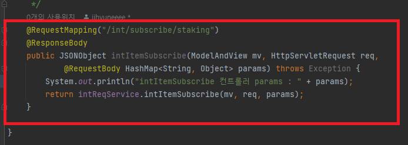

# **# Controller에서 JSON 데이터 받을시 주의사항**

기존 관리자 페이지에 존재하던 페이지 중 사실상 전혀 사용하지 않아 기능마저 에러 발생으로 인해 사용하지 못하던 페이지가 있었다.   

이번에 이 페이지를 리뉴얼하며 앞으로 사용하기로 결정되어 내가 기능 구현을 맡게되었다.

기존 소스 코드를 활용하여 페이지 재구현하던 중 에러를 마주하게 되었다.
### **<console 창에 찍힌 에러>**

405 POST 에러와 함께 'data is not defined'라며 데이터를 찾을 수 없다는 에러 메시지가 나왔다.

### **<Controller 코드와 Intellij 터미널창>**

아무 응답을 못받으니 역시 터미널창에 아무 것도 찍히지 않는다.

 

에러 해결을 위해 구글링 하던 중 ajax를 통해 json 데이터를 보내려면 
data : JSON.stringify(보낼 데이터), 
contentType : "application/json" 으로 설정 해줘야 @RequestBody로 데이터를 받을 수 있다는 글을 찾게 되었다.

**<수정 전 ajax 코드>**

 

**<수정 후 ajax 코드>**

찾은 내용데로 수정하니 정상적으로 데이터가 Controller로 전송되며 에러가 해결되었다.
 

이 부분에 있어 정확히 짚고 넘어가기 위해 제대로 구글링 해본 결과 아래와 같은 이유로 에러 발생 및 해결이 된것으로 확인하였다.

    data : JSON.stringify(데이터명(=변수명))으로 서버에 전송하는 것은

    즉, Map 담은 데이터를 json 문자열로 변형하여 서버에 전송하는 것이고,

    서버에서 파라미터가 담긴 Map을 json 형태로 받으려면 @RequestBody를 사용해야 한다는 것이다.

    @RequestBody, @ResponseBody는 스프링에서 비동기 처리(ajax 통신)를 하는 경우 사용되는 어노테이션이다.

- **Client -> Server = 요청(request) 메시지**

- **Server -> Client = 응답(response) 메시지**

 

비동기통신을 하기위해서는 클라이언트에서 서버로 요청 메세지를 보낼 때, 본문에 데이터를 담아서 보내야 하고

서버에서 클라이언트로 응답을 보낼때에도 본문에 데이터를 담아서 보내야 한다. 

이 본문이 바로 body 이다.

즉, **요청본문 => requestBody / 응답본문 => responseBody**로 담아서 보내야 한다.

    **Client -> Server**로 필요한 데이터를 요청하기 위해 JSON 데이터를 요청 본문에 담아 서버로 보내면, 서버에서는 @RequestBody 어노테이션을 사용하여 HTTP 요청 메시지 본문에 담긴 값을 자바객체로 변환시켜, 객체에 저장한다.

    **Server ->  Client** 응답 데이터를 전송하기 위해 @ResponseBody 어노테이션을 사용하여 자바 객체를 HTTP 응답 메시지 본문의 객체로 변환하여 클라이언트로 전송한다.

>**<참고사항>**   
>
>***@RestController**   
>
>@Controller와는 다르게 @RestController는 리턴값에 자동으로 @ResponseBody가 붙게되어 별도 어노테이션을 명시해주지 않아도 HTTP 응답데이터(body)에 자바 객체가 매핑되어 전달 된다.
>@Controller인 경우에 바디를 자바객체로 받기 위해서는 @ResponseBody 어노테이션을 반드시 명시해주어야한다. 

